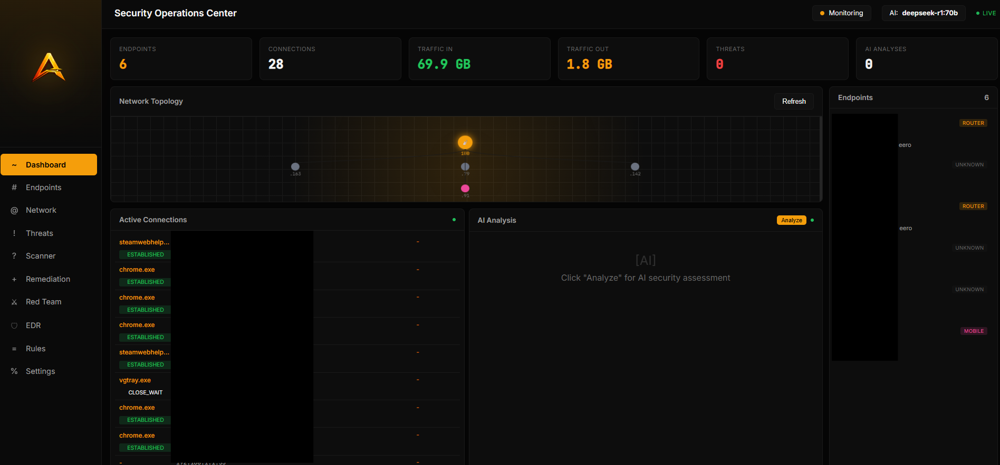
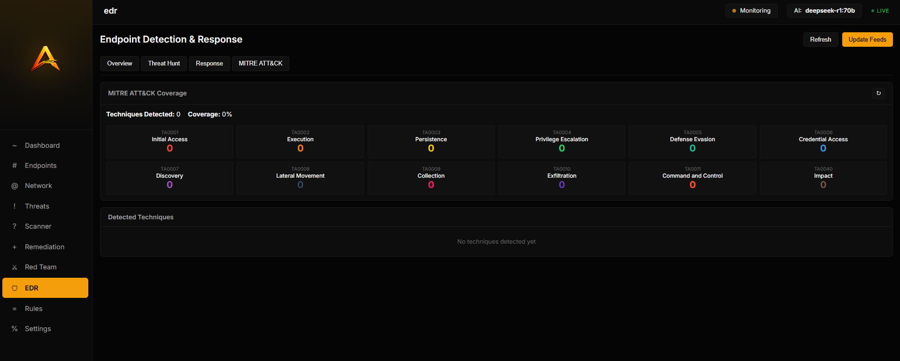
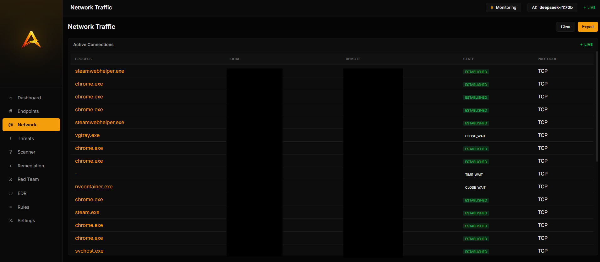
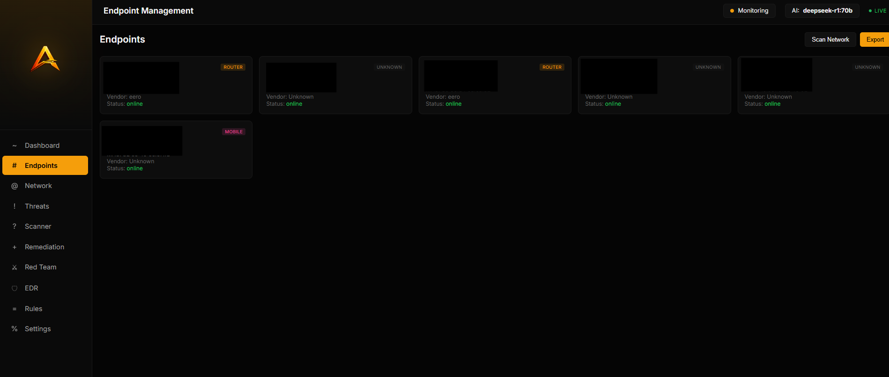
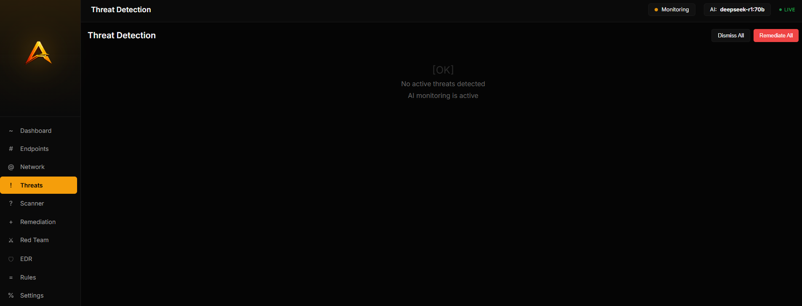
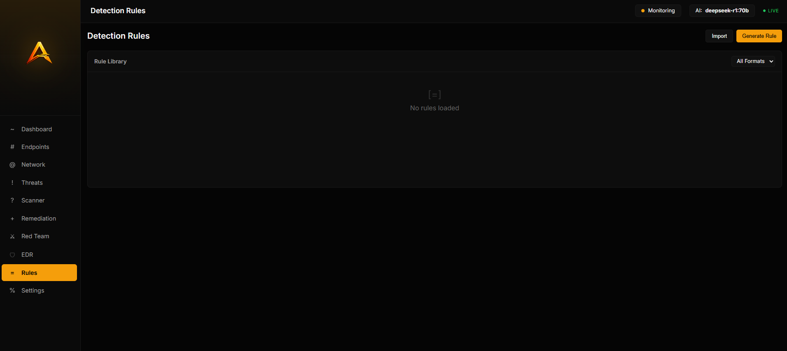
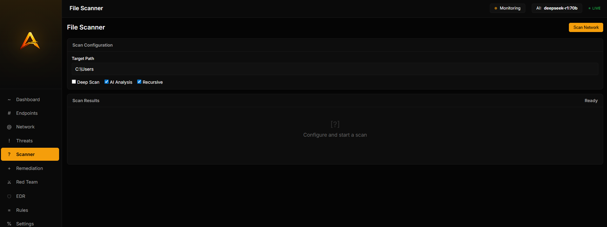
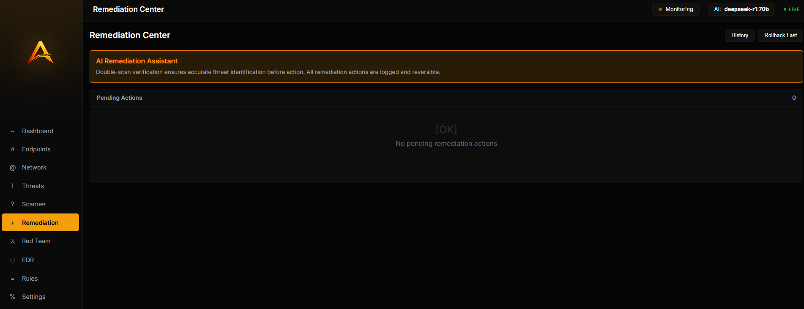
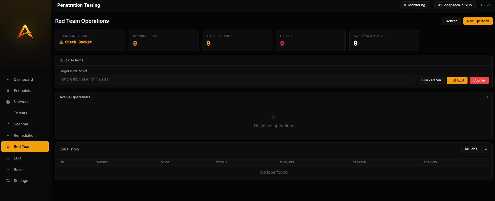

<p align="center">
  
</p>

# Project Artemis

> **Hello everyone, Welcome to Project Artemis.**
>
> This initiative was developed with significant AI assistance and remains very much a work in progress. With your collaboration and expertise, the goal is to build a practical, AI-centric EDR and cybersecurity solution designed specifically for small businesses, nonprofits, and organizations operating with limited budgets.
>
> Project Artemis is **not intended to replace a qualified cybersecurity team** or a comprehensive security program. Instead, it is designed to serve as an accessible, supportive layer of protection, providing meaningful visibility, quality logging, and actionable information that can assist cybersecurity professionals when deeper analysis or intervention is required. Rather than relying on end users to describe what they believe they saw, Artemis aims to capture and present clear, structured data.
>
> The long-term vision is to create a secure, locally running tool that performs foundational cybersecurity functions, offers basic remediation capabilities, and strengthens defensive posture in a responsible and controlled manner. This solution is meant for those who often go underserved — small charities, resource-constrained organizations, and even home users who need practical protection without enterprise-level budgets.
>
> Our priorities are **simplicity, reliability, and safety**. The platform should be intuitive enough for non-technical users while still generating valuable technical insight. It should empower users to improve their security posture without overwhelming them or requiring significant financial investment in audits and remediation they may not fully understand.
>
> Thank you for being part of this effort. I look forward to collaborating with you to build something meaningful, responsible, and impactful.
>
> *— Jake*

---

**AI-Powered Security Operations Platform**

A comprehensive cybersecurity toolkit combining detection engineering, endpoint detection & response (EDR), network monitoring, and AI-assisted threat analysis. Built for security professionals who want enterprise-grade capabilities without the enterprise price tag.


---

## Screenshots

<details>
<summary><b>Control Center</b> — Main dashboard overview</summary>
<p align="center">
  
</p>
</details>

<details>
<summary><b>EDR Module</b> — Endpoint detection and response</summary>
<p align="center">
  
</p>
</details>

<details>
<summary><b>Network Traffic</b> — Real-time connection monitoring</summary>
<p align="center">
  
</p>
</details>

<details>
<summary><b>Endpoints</b> — Device discovery and management</summary>
<p align="center">
  
</p>
</details>

<details>
<summary><b>Threat Detection</b> — Active threat monitoring</summary>
<p align="center">
  
</p>
</details>

<details>
<summary><b>Detection Ruleset</b> — AI-generated security rules</summary>
<p align="center">
  
</p>
</details>

<details>
<summary><b>File Scanner</b> — Malware and file analysis</summary>
<p align="center">
  
</p>
</details>

<details>
<summary><b>Remediation Center</b> — Response actions and quarantine</summary>
<p align="center">
  
</p>
</details>

<details>
<summary><b>Red Team</b> — Penetration testing module</summary>
<p align="center">
  
</p>
</details>

---

## Features

### Detection Engineering
- **Natural language to detection rules** — Describe a threat, get deployable rules
- **Multiple formats** — Sigma, YARA, Splunk SPL, KQL, Snort/Suricata
- **MITRE ATT&CK mapping** — Automatic technique tagging
- **Rule validation** — Syntax and logic checks

### EDR (Endpoint Detection & Response)
- **Process monitoring** — Real-time process creation/termination tracking
- **Sysmon integration** — Parse all 29 event types with threat detection
- **Threat intelligence** — 6 free feeds, 27,000+ IoCs (IPs, hashes)
- **Response actions** — Kill process, block IP, quarantine file
- **MITRE ATT&CK heatmap** — Visual coverage across tactics
- **Threat hunting** — Query syntax with field:value operators

### Network Security
- **Device discovery** — ARP scanning with MAC vendor lookup (2000+ OUIs)
- **Connection monitoring** — Real-time network connections via psutil
- **Traffic analysis** — Bandwidth monitoring and anomaly detection
- **Smart classification** — Automatic device type detection

### AI Analysis
- **Local inference** — Ollama with DeepSeek/Qwen (no API keys needed)
- **Cloud providers** — Anthropic Claude, OpenAI GPT-4
- **Security analysis** — AI-powered threat assessment and recommendations

### SOC Dashboard
- **Real-time monitoring** — Device, connection, and threat views
- **Security posture** — Risk scoring (0-100), A-F grades
- **Unified timeline** — All security events in one view

---

## Quick Start

### Prerequisites

- Python 3.10+
- Windows 10/11 (for full EDR features) or Linux/macOS
- [Ollama](https://ollama.ai) (recommended for local AI)

### Installation

```bash
# Clone the repository
git clone https://github.com/bytecreeper/Project_artemis_EDR.git
cd Project_artemis_EDR

# Create virtual environment (recommended)
python -m venv venv
venv\Scripts\activate  # Windows
# source venv/bin/activate  # Linux/macOS

# Install dependencies
pip install -e ".[all]"
```

### Configuration

```bash
# Copy example settings
cp settings.example.json settings.json

# Edit settings.json with your network range
{
  "provider": "ollama",
  "model": "deepseek-r1:70b",
  "network_range": "192.168.1.0/24",  # <-- Your network
  "scan_interval": 5
}
```

### Start the Dashboard

```bash
# Start the web server
python -m uvicorn src.artemis.web.app:app --host 127.0.0.1 --port 8000

# Open http://127.0.0.1:8000 in your browser
```

---

## Detailed Setup

### Local AI (Recommended)

For fully offline, private operation:

```bash
# Install Ollama
winget install Ollama.Ollama  # Windows
# brew install ollama         # macOS
# curl -fsSL https://ollama.ai/install.sh | sh  # Linux

# Pull a model (choose based on your RAM)
ollama pull qwen3:14b        # Fast, 9GB, needs 16GB RAM
ollama pull qwen3:32b        # Balanced, 20GB, needs 32GB RAM  
ollama pull deepseek-r1:70b  # Best quality, 42GB, needs 64GB RAM
```

### Cloud AI (Optional)

```bash
# Set environment variables
export ANTHROPIC_API_KEY="sk-ant-..."  # For Claude
export OPENAI_API_KEY="sk-..."         # For GPT-4
```

### Sysmon Setup (Windows EDR)

Sysmon provides deep Windows telemetry for the EDR module:

```powershell
# Run as Administrator
cd Project_artemis_EDR

# Install Sysmon with our config
.\tools\Sysmon\Sysmon64.exe -accepteula -i config\sysmon-config.xml

# Start event forwarding to Artemis
.\scripts\Forward-SysmonEvents.ps1 -Continuous
```

### Threat Intelligence

Update threat feeds (27,000+ IoCs from 6 free sources):

```bash
# Via API
curl -X POST http://127.0.0.1:8000/api/edr/threat-intel/update

# Or via CLI
artemis edr update-feeds
```

---

## Usage

### CLI - Detection Engineering

```bash
# Generate a Sigma rule
artemis generate "Detect PowerShell downloading files from the internet"

# Generate YARA with local AI
artemis generate "Detect Mimikatz in memory" -f yara -p ollama -m qwen3:32b

# Batch generation from file
artemis batch threats.txt --save rules/
```

### CLI - Network Scanning

```bash
# Discover devices on your network
artemis network scan -s 192.168.1.0/24

# Get device info
artemis network info 192.168.1.1
```

### API Endpoints

| Endpoint | Method | Description |
|----------|--------|-------------|
| `/api/health` | GET | Health check |
| `/api/devices` | GET | List discovered devices |
| `/api/connections` | GET | Active network connections |
| `/api/threats` | GET | Current threat indicators |
| `/api/ai/analyze` | POST | AI security analysis |
| `/api/edr/status` | GET | EDR component status |
| `/api/edr/alerts` | GET | All EDR alerts |
| `/api/edr/threat-intel/check` | POST | Check IoCs against feeds |
| `/api/edr/threat-intel/update` | POST | Update threat feeds |

### Python API

```python
import asyncio
from artemis import Artemis, RuleFormat

async def main():
    engine = Artemis(provider="ollama", model="qwen3:32b")
    
    result = await engine.generate(
        description="Detect scheduled task persistence",
        format=RuleFormat.SIGMA,
        severity_hint="high",
    )
    
    if result.success:
        print(result.rule.content)
        print(f"MITRE: {[m.technique_id for m in result.rule.mitre]}")

asyncio.run(main())
```

---

## Architecture

```
Project_artemis_EDR/
├── src/artemis/
│   ├── core.py              # Main Artemis engine
│   ├── cli.py               # Click CLI
│   ├── llm.py               # LLM provider abstraction
│   ├── models.py            # Pydantic models
│   │
│   ├── generators/          # Detection rule generators
│   │   ├── sigma.py         # Sigma rules
│   │   ├── yara.py          # YARA rules
│   │   └── splunk.py        # Splunk SPL
│   │
│   ├── edr/                 # EDR module
│   │   ├── sysmon.py        # Sysmon event parser (29 types)
│   │   ├── process_monitor.py # Real-time process monitoring
│   │   ├── threat_intel.py  # Threat feed integration
│   │   ├── risk_score.py    # Security posture scoring
│   │   ├── response.py      # Kill/block/quarantine actions
│   │   └── timeline.py      # Unified event timeline
│   │
│   ├── agent/               # Network monitoring
│   │   ├── scanner.py       # ARP network scanner
│   │   ├── fingerprint.py   # Device classification
│   │   └── traffic.py       # Traffic monitoring
│   │
│   └── web/                 # Web dashboard
│       ├── app.py           # FastAPI application
│       └── templates/       # Jinja2 templates
│
├── config/
│   └── sysmon-config.xml    # Production Sysmon config
│
├── scripts/
│   └── Forward-SysmonEvents.ps1  # Event forwarding
│
├── tools/
│   └── Sysmon/              # Sysmon binaries
│
├── docs/                    # Documentation
├── tests/                   # Test suite
└── settings.example.json    # Example configuration
```

---

## Security Considerations

### What This Tool Does
- Monitors YOUR network for threats
- Runs locally with no external data transmission (when using Ollama)
- Provides defensive security capabilities

### What This Tool Does NOT Do
- No offensive capabilities against external targets
- No data exfiltration
- No persistent backdoors

### Best Practices
1. **Network range** — Only configure YOUR network in `settings.json`
2. **API keys** — Never commit API keys; use environment variables
3. **Threat intel** — IoCs are pulled from public feeds only
4. **Response actions** — Kill/block/quarantine are LOCAL only

---

## Development

```bash
# Install dev dependencies
pip install -e ".[dev]"

# Run tests
pytest

# Format code
black src tests
ruff check src tests

# Type checking
mypy src
```

### Contributing

1. Fork the repository
2. Create a feature branch (`git checkout -b feature/amazing-feature`)
3. Commit your changes (`git commit -m 'Add amazing feature'`)
4. Push to the branch (`git push origin feature/amazing-feature`)
5. Open a Pull Request

Please ensure:
- No hardcoded IPs, paths, or credentials
- Tests pass
- Code is formatted with Black

---

## Documentation

- [EDR Module Guide](docs/EDR_MODULE.md)
- [Dashboard Improvements](docs/DASHBOARD_IMPROVEMENTS.md)
- [API Reference](docs/API.md) *(coming soon)*

---

## Roadmap

- [x] Sigma/YARA/SPL rule generation
- [x] MITRE ATT&CK mapping
- [x] Local LLM support (Ollama)
- [x] Web dashboard
- [x] Network discovery
- [x] EDR with Sysmon integration
- [x] Threat intelligence (6 feeds)
- [x] Response actions
- [x] Risk scoring
- [ ] Rule testing against sample logs
- [ ] Cross-platform EDR (Linux auditd)
- [ ] SOAR playbook automation
- [ ] Sigma rule sharing/import

---

## License

MIT License — see [LICENSE](LICENSE) for details.

---

## Acknowledgments

- [Sigma](https://github.com/SigmaHQ/sigma) — Detection rule format
- [Sysmon](https://docs.microsoft.com/en-us/sysinternals/downloads/sysmon) — Windows telemetry
- [Ollama](https://ollama.ai) — Local LLM inference
- [SwiftOnSecurity](https://github.com/SwiftOnSecurity/sysmon-config) — Sysmon config inspiration
- Threat feed providers: URLhaus, Feodo Tracker, ThreatFox, MalwareBazaar, blocklist.de, Emerging Threats

---

<p align="center">
  <b>Built for defenders, by defenders.</b>
</p>
